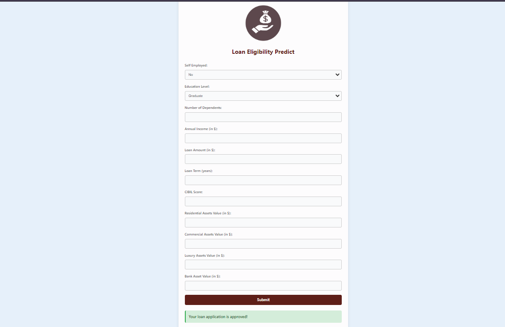

# Loan Eligibility Prediction

## Project Overview

The **Loan Eligibility Prediction** project is a machine learning application designed to assess the likelihood of loan approval based on various applicant factors. This tool estimates eligibility using data such as income, credit history, loan amount, and other relevant financial metrics.

## Dataset Information

The dataset used in this project consists of multiple features that provide insights into loan applicants. Below are the details of the dataset:

| Column Name                    | Description                                                |
|--------------------------------|------------------------------------------------------------|
| **no_of_dependents**           | Number of dependents the applicant has.                   |
| **education**                  | Education level of the applicant (Graduate/Not Graduate). |
| **self_employed**              | Employment status (Yes/No).                               |
| **income_annum**               | Annual income of the applicant (in currency).             |
| **loan_amount**                | Requested loan amount (in currency).                       |
| **loan_term**                  | Duration of the loan (in months).                          |
| **cibil_score**                | Credit score of the applicant.                             |
| **residential_assets_value**    | Value of the applicant's residential assets.              |
| **commercial_assets_value**    | Value of the applicant's commercial assets.               |
| **luxury_assets_value**        | Value of the applicant's luxury assets.                   |
| **bank_asset_value**           | Value of the applicant's bank assets.                     |
| **loan_status**                | Indicator of loan approval (Approved/Rejected).           |

**Target Variable**:
- **`loan_status`**: A binary indicator of loan approval (1: Approved, 0: Rejected).

### Dataset Source
- **Data Source**: [Access dataset](./notebook/data)

## Categorical Variables

The categorical variables **education**, **self_employed**, and **loan_status** are essential for prediction.

- **Education**:
  - Graduate
  - Not Graduate

- **Self Employed**:
  - Yes
  - No

- **Loan Status**:
  - Approved
  - Rejected

## Deployment Link
- [Deployment App](https://sureshbeekhani-loan-eligibility-prediction.hf.space)

## Screenshot of UI

## Project Approach

1. **Data Ingestion**:
   - Read data from CSV files.
   - Split the dataset into training and testing sets, saving them as CSV files.

2. **Data Transformation**:
   - Create a `ColumnTransformer` pipeline for preprocessing.
   - **For Numeric Variables**:
     - Use `SimpleImputer` with median strategy for missing values.
     - Apply standard scaling.
   - **For Categorical Variables**:
     - Use `SimpleImputer` with the most frequent strategy for missing values.
     - Apply one-hot encoding for categorical variables.
   - Save the preprocessor as a pickle file for later use.

3. **Model Training**:
   - Experiment with various machine learning models to identify the best performers.
   - Perform hyperparameter tuning to enhance model performance.
   - Create an ensemble model that combines predictions from multiple algorithms.
   - Save the final model as a pickle file for deployment.

4. **Prediction Pipeline**:
   - Convert input data into a DataFrame for prediction.
   - Implement functions to load the pre-trained model and make predictions.

5. **Flask App Creation**:
   - Develop a Flask application with a user-friendly interface for loan eligibility predictions.

## Additional Resources

- **Exploratory Data Analysis (EDA) Notebook**: [View EDA Notebook](./notebook/loan_approval_EDA.ipynb) - This notebook provides insights into the dataset, including visualizations and statistical summaries that help understand patterns and relationships within the data.
- **Model Training Notebook**: [View Model Training Notebook](./notebook/MODEL%20TRAINING.ipynb) - This notebook details the training of various machine learning models, evaluation of their performance, and selection of the best model for predicting loan eligibility.

